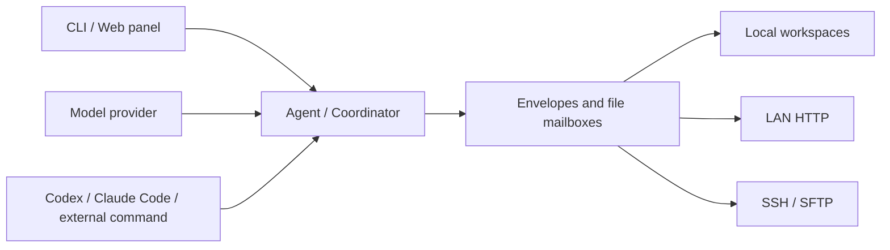

# AntHill

AntHill is a multi-agent collaboration framework built around file mailboxes. It lets local
model agents, Codex, Claude Code, command-line tools, and human-operated sessions communicate
through one message protocol, with orchestration, cross-machine delivery, and a web control
panel included.

[中文](./README.md) · [Quick-start guide](./QUICKSTART.md) · [License](./LICENSE)

## Why AntHill

Many multi-agent systems couple transport, model calls, and scheduling in one process. AntHill
stores messages as envelope files inside a workspace. Transports only deliver envelopes to a
mailbox; how an agent handles a message is independent of where that message came from.

This design provides:

- **Traceable communication:** delivery, receipts, retries, and results are persisted and can
  recover after a process restart.
- **Different kinds of agents:** call a model API, run an external command, connect an
  interactive terminal, or let a person reply directly.
- **Consistent local and remote behavior:** same-workspace, same-machine, LAN, and SSH delivery
  use the same envelope protocol.
- **Observable collaboration:** the panel, structured logs, and task blackboard show agents,
  messages, and run state.

## Features

- Maildir-style file mailboxes with atomic writes, idempotent consumption, receipts, retries,
  and dead-letter handling
- Routing by agent name, role, and `@mention`
- Anthropic and OpenAI-compatible model providers
- ReAct tool loop with path, budget, and high-risk-operation controls
- Coordinator planning, dependency scheduling, conditional steps, human approval, timeouts,
  and artifact validation
- Optional agent role cards for responsibilities, expertise, and working style
- Web panel for workspaces, agents, providers, messages, and runs
- LAN discovery and pairing, HMAC-signed delivery, and SSH/SFTP transport
- Codex, Claude Code, external command, and human-session bridges
- MCP server and client integration

## How it works



Each workspace has a `.anthill` directory containing node configuration, agent mailboxes,
thread history, task state, and logs. Messages are written to a temporary file and atomically
renamed into the inbox. An agent archives a message and completes its deduplication record only
after processing, so a claimed message can be recovered after an interrupted run.

## Requirements

- Python 3.11 or newer
- [uv](https://docs.astral.sh/uv/)
- API credentials for any model providers you plan to use

## Installation

```bash
git clone https://github.com/ykxian/anthill.git
cd anthill
uv sync --extra llm
```

Install the optional MCP integration as well:

```bash
uv sync --extra llm --extra mcp
```

## Quick start

Start a writable control panel from the repository root:

```bash
uv run anthill serve -w ./demo --panel-write
```

Open <http://127.0.0.1:45778/panel>. The first run creates the workspace. From the panel you can:

1. Configure a model provider and API key.
2. Create an agent with a worker, coordinator, or bridge role.
3. Add an optional role card and select its tools.
4. Start the agent, send a message, or create an orchestrated run.

Secrets are stored in `~/.anthill/secrets.env`, not in the workspace's `node.toml`.

The equivalent CLI workflow is:

```bash
uv run anthill agent list -w ./demo
uv run anthill agent start echo -w ./demo
uv run anthill send echo "Describe the current workspace" --wait 30 -w ./demo
uv run anthill status -w ./demo
```

An orchestrated run requires at least one coordinator with a model provider:

```bash
uv run anthill run "Check the test suite and have a reviewer verify the result" -w ./demo
```

See [QUICKSTART.md](./QUICKSTART.md) for provider setup, Codex and Claude Code integration,
and troubleshooting.

## Agent types

AntHill uses one runtime for several kinds of agents:

| Type | Purpose |
|---|---|
| Provider agent | Calls an Anthropic or OpenAI-compatible model and uses controlled tools |
| Coordinator | Plans dependency steps, delegates work, and combines deliveries |
| Command agent | Starts an external command for each message, such as `codex exec` or `claude -p` |
| Bridge agent | Connects a persistent Codex or Claude Code session, or a human operator |
| Echo agent | Tests workspace, routing, and transport behavior without calling a model |

A role card is optional project data describing an agent's responsibilities and preferences.
It does not grant tools, increase source trust, or bypass fixed safety rules and approvals.

## Cross-machine collaboration

Listen on the LAN interface on each participating machine:

```bash
uv run anthill serve -w ./demo --host 0.0.0.0 --panel-write
```

After discovery, pair the nodes with a one-time PIN:

```bash
# Machine A
uv run anthill peers pair -w ./demo

# Machine B
uv run anthill peers pair --to <node-a> --pin <six-digit-pin> -w ./demo
```

Compare the fingerprints displayed on both machines. Discovery only makes a node visible;
an unpaired node cannot deliver messages or read state. For servers that are reachable only
over SSH, AntHill can deliver over SFTP and retrieve replies and artifacts with `anthill pull`
and `anthill fetch`.

## Common commands

```bash
uv run anthill doctor -w ./demo             # Check config, secrets, mailboxes, and processes
uv run anthill guide                        # Browse commands by workflow
uv run anthill agent ps                     # List agentd processes across local workspaces
uv run anthill runs -w ./demo               # Inspect run history
uv run anthill cost -w ./demo               # Inspect token usage and cost
uv run anthill log echo --follow -w ./demo  # Follow structured logs
uv run anthill dead list -w ./demo           # Inspect dead letters
```

## Security boundaries

- `anthill serve` binds to `127.0.0.1` by default; external listening requires `--host`.
- The panel is read-only by default. Write access is explicit and protected by local-origin or
  panel-token authentication.
- Project configuration stores environment-variable names, while secrets are kept separately
  with restricted file permissions.
- Unpaired nodes are untrusted. Cross-node requests are signed and checked against a time window.
- Message bodies, the shared blackboard, and role cards are untrusted project data and cannot
  override fixed system safety rules.
- File tools are confined to the workspace and check normalized paths and symlink escapes.
- High-risk operations require confirmation; unattended operations that cannot be confirmed are
  denied.
- External Codex, Claude Code, and command-line programs retain their own permission systems;
  AntHill does not bypass them.

A panel token carries administrative access to the workspace. Do not send it over plaintext HTTP
on an untrusted network; prefer SSH port forwarding for remote administration.

## Workspace layout

```text
demo/.anthill/
├── node.toml                 # Node, provider, and agent configuration
├── agents/<name>/
│   ├── mailbox/              # Inbox, outbox, receipts, and dead letters
│   ├── threads/              # Conversation history
│   └── bridge/               # Optional interactive bridge files
├── blackboard/
│   ├── BOARD.md              # Shared status summary
│   └── tasks/<task_id>/      # Run state and artifacts
└── logs/                     # Structured runtime logs
```

## Development

Install all development dependencies:

```bash
uv sync --all-groups --all-extras
```

Run the checks:

```bash
uv run pytest
uv run ruff check anthill tests
uv run ruff format --check anthill tests
uv run mypy anthill
```

Browser tests require Chromium:

```bash
uv run playwright install chromium
```

## License

[MIT](./LICENSE)
