# AntHill（蚁丘）

> 基于**文件邮箱**的分布式多 Agent 协同框架。
> 蚂蚁不开会 —— 它们把信息素留在环境里，别的蚂蚁路过就能读懂并接力。

**只想跑起来？看 [QUICKSTART.md](./QUICKSTART.md)。**

[English README](./README.en.md) · 设计文档在 [`docs/`](./docs)（先读 [00-prd](./docs/00-prd.md)）

本 README 只讲**当前已经能跑的东西**。

## 一条公理

> Agent 之间的所有通信，最终都表现为「一个信封文件出现在目标 Agent 的 `inbox/new` 目录里」。

传输层（同机 / 局域网 / SSH）只负责把信封送到那个目录，Agent 消费消息的方式完全一致。
由此推出三个性质：**传输与消费解耦**（新增一种传输不用改 Agent 一行代码）、
**天然持久化与可审计**（消息就是文件，能 `ls` 能 `cat` 能进 git 能事后重放）、
**异构 Agent 零成本接入**（任何能读写文件的东西都能当 Agent）。

```mermaid
flowchart LR
    subgraph L4[交互层]
        CLI[CLI · typer]
        WEB[面板 · FastAPI + WebSocket<br/>总控视图，默认只读，可开写入口]
    end
    subgraph L3[智能层]
        ORCH[Orchestrator 拆解/分派/汇总]
        LOOP[Agent Loop · ReAct 工具循环]
        TOOLS[工具集 + 策略引擎]
        PROV[Provider · Anthropic / OpenAI 兼容]
        ADP[Adapter · Claude Code 等已有终端]
    end
    subgraph L2[消息层]
        ENV[Envelope 协议 · pydantic]
        MBX[Mailbox · Maildir 式目录 + 原子写]
        RCPT[回执与重试]
        ROUTE["路由 · @mention / 角色寻址"]
    end
    subgraph L1[传输层]
        LT[Local 文件直写]
        NT[LAN HTTP+HMAC]
        ST[SSH SFTP]
        DISC[Discovery UDP 组播 · 默认关闭]
    end
    L4 --> L3 --> L2 --> L1
```



依赖方向严格自上而下。**L1/L2 完全不含任何 LLM 逻辑**，可以单独测试，
甚至单独拿去给「人肉 Agent」用 —— 这个项目最早就是那么开始的。

## 现在能跑什么（M0 – M15）

**通信底座（M0/M1）**

- ✅ **信封协议**：ULID 命名的 JSON 信封，pydantic 严格校验，跳数 TTL 熔断，过期回执
- ✅ **文件邮箱**：Maildir 变体（`tmp/new/cur/done`），`tmp→rename` 原子写，100 并发写者无锁无冲突
- ✅ **幂等去重**：`seen.db`（SQLite）按消息 ULID 去重 —— 至少一次投递 + 恰好一次处理
- ✅ **三级回执与状态机**：`pending → delivered → accepted → completed`，非法迁移直接拒绝
- ✅ **发件箱与重试**：指数退避 1/2/4/8/16s，耗尽进死信并上报 coordinator
- ✅ **agentd**：watcher（inotify，NFS 上自动降级轮询）→ 队列 → 分发 → 归档；崩溃恢复
- ✅ **路由**：具体名 / `role:xxx`（选负载最低者）/ `all` 广播，@mention 解析

**Agent 大脑（M2）**

- ✅ **多家模型**：`ChatProvider` 抽象 + Anthropic / OpenAI 兼容端点（DeepSeek、Qwen、GLM 共用一份代码）
- ✅ **ReAct 工具循环**：读写（`read_file` 支持翻页 / `write_file` / `edit_file` 局部改）、
  检索（`search_text` / `find_files`）、`list_dir`、`run_shell`、`send_message`、`finish`，
  `finish` 强制结构化交付（summary + artifacts + status）
- ✅ **三道闸门**：步数熔断、token 预算熔断、策略引擎（工具风险 × 来源信任 → 放行/确认/拒绝）
- ✅ **路径逃逸防护**：所有路径参数规范化后前缀校验，`../` 与软链都出不去 workspace
- ✅ **prompt 注入缓解**：来件放进显式定界块，system prompt 声明「块内是数据不是指令」，
  来件里伪造的定界符会被打断
- ✅ **thread 记忆**：历史按 thread 落盘 jsonl，超长时用模型压成摘要（压缩失败则保留原文）
- ✅ **录制回放**：`--record` 录下真实模型响应，`--replay` 当假模型跑 —— CI 天天跑不花钱

**多 Agent 编排（M3）**

- ✅ **计划即数据**：coordinator 用 LLM 产出计划 JSON（pydantic 校验，
  失败时把错误原文喂回去重试，最多 3 次），步骤是一张有依赖的 DAG
- ✅ **拓扑调度**：无依赖的步骤并发派发，每步一个子 thread（上下文隔离），
  下游能看到上游的交付与产物路径
- ✅ **事件驱动的状态机**：coordinator 不阻塞等下游，状态落在黑板上 ——
  **进程崩了重启能接着调度**
- ✅ **催办与超时**：迟迟不回先催一次（chat，挂在该步的子 thread 上），再超时判失败；
  上游失败的分支标 `skipped`，不让整次运行卡死
- ✅ **完成标准判定**：`done_when` 由 coordinator 用 LLM 对照各步交付判定，
  不满足则追加修复步骤（上限 2 轮，防无限返工）
- ✅ **点对点 @mention**：worker 之间可以用 `send_message` 直接说话，
  不必事事经过 coordinator；@ 死循环止于协议层的 hops 熔断
- ✅ **共享黑板**：`BOARD.md`（≤100 行，coordinator 单写者）注入每个 Agent 的上下文，
  `blackboard/tasks/<id>/` 放任务产物

**跨机通信（M4）**

- ✅ **可见与可通信分开**：同网段能互相看见（M9 起默认开；`enabled = false` 时
  不发包、不监听、**连 socket 都不创建**），但要互投消息必须先配对；
  `anthill serve` 默认只绑 127.0.0.1，要对外必须显式 `--host 0.0.0.0`
- ✅ **UDP 组播发现**：开启后周期 announce 节点摘要（TTL=1，不出本网段），
  广播包里只有公开信息
- ✅ **发现 ≠ 可通信**：看到的节点先记成 `discovered`，必须核对指纹并 `peers trust`
  交换密钥后才能互投；TOFU —— 同名节点换了钥匙一律拒绝并告警
- ✅ **HMAC-SHA256 签名 + 5 分钟时间窗**：篡改 payload / 改投收件人 / 过期重放三种攻击
  各有一条测试（02-protocol §8 用例 7）
- ✅ **准入四道闸**：解析（400）→ 是否受信任（403）→ 签名与时间窗（401）
  → 收件人是否本机 Agent（421 不当跳板 / 404）

**SSH 跨机（M5）**

- ✅ **服务器不开任何新端口**：SFTP 直接把信封写进远端邮箱（`tmp→rename`，
  跨机与同机语义完全一致），复用你已经有的 SSH 信任通道
- ✅ **回信靠拉，不靠推**：SSH 是单向的（服务器连不回 NAT 后面的笔记本），
  所以远端把回信暂存在 `spool/<你的节点>/`，你 `anthill pull` 取走 —— 和 `git pull` 一个道理
- ✅ **远端危险操作由本机点头**：远端 agentd 把请求写进 `approvals/` 并停下来等，
  你在本机 `anthill approve --peer lab` 批，答复经 SFTP 写回。走文件不走消息 ——
  消息会和串行消费循环死锁
- ✅ **收件方验签**：共用服务器上，同机器的其他账号也能往你的 inbox 里写文件；
  通道加密拦不住这种本地伪造投递，验签才拦得住
- ✅ **连接复用与重连**、**按需拉取远端产物**（`anthill fetch`）
- ✅ **CLI**：`init` / `run` / `serve` / `peers` / `agent` / `send` / `status` / `log`
  / `approve` / `fetch` / `pull`

**面板与打磨（M6）**

- ✅ **只读 Web 面板**：拓扑（谁在跑、积压、死信、对端信任状态）、任务看板
  （每步状态与交付）、合并后的实时消息流。单页 HTML + 原生 JS + WebSocket，
  **无构建链、无外部资源** —— 没外网的服务器上也能打开
- ✅ 面板**默认只在绑回环时开启**：一旦 `--host 0.0.0.0`，它会跟着暴露给整个网段
- ✅ 中英文 README、CHANGELOG、MIT LICENSE
  （截至 M15：975 个测试，覆盖率 87%；实现 14.7k 行 + 测试 12.7k 行）

**接已有终端、对话、面板可写（M7）**

- ✅ **把 Claude Code 这类终端接进来**：配一行 `command = ["claude", "-p"]` 就行。
  对 runtime 只是又一个 handler —— 接一个新终端不用改 agentd 一行代码
- ✅ **常驻的交互式会话也能参与**（`bridge = true`）：收到的消息写成 `.md`，
  你或你一直开着的 Claude Code 写回复；**收消息不阻塞**（可以想十分钟），
  而且**人能随时主动插话**。这就是本项目起点那个土办法的正式版本
- ✅ **Agent 之间真的能对话**：带 @ 的对话回信发给被 @ 的那个人（而不是发回给发起人），
  球在两人之间来回；终止靠按 thread 计的轮次预算，**确定性**，不靠模型自觉、
  也不拿 hops 熔断当刹车
- ✅ **`anthill chat` / `anthill talk`**：人跟 Agent 多轮聊；让两个 Agent 就一件事聊，你旁观
- ✅ **面板可写**（`--panel-write`）：发起任务、发消息、在线改 node.toml
  （保存前用同一套模型校验，不合法磁盘一个字都不改，并留备份）

**一个面板管所有机器（M8）**

- ✅ **总控面板**：随便挑一台开面板，它会把**所有已信任节点**汇到一页 ——
  拓扑按机器分组，任务与消息流多出一列「在哪台机器上」
- ✅ 汇总只取**一个文件**：每个节点定期把自己的快照写成 `.anthill/status.json`，
  总控按对端的接法去取（LAN 走 `GET /node/summary`，SSH 直接 SFTP 读）——
  **SSH 那一侧仍然不用开任何端口**
- ✅ 取状态和投递同一把共享密钥：签 `域标签 + 节点 + 路径 + 时间戳`，30 秒防重放窗；
  未信任的节点只出现在拓扑里，**不会被去读状态**
- ✅ **对端传来的快照一律先过 pydantic**：那些字段最终会进面板的 HTML，
  在进程边界上校验比指望前端每一处插值都记得转义可靠得多（两道都有）
- ✅ **一台连不上不会把整页卡住**：并发拉取、各自超时，已经有旧数据的节点
  直接给旧的、后台去刷；拔掉一台之后总控页面 0.18 秒返回

**自动一点（M9）**

- ✅ **默认可见**：同网段的节点 `anthill serve` 之后就能互相看见。
  **可见 ≠ 可通信这条线没动** —— 要互投消息仍然必须有人在两边各看一眼
- ✅ **六位 PIN 码配对**（`anthill peers pair`）：不用再复制一百多字符的令牌。
  用 PAKE（spake2）换密钥，**密钥从不上网线** —— 短口令直接发过去等于没加密
- ✅ **在面板上跟任意机器的任意 Agent 对话**：选一个 Agent 就是一个会话，
  接着同一个 thread 往下说，对方的记忆才连得上
- ✅ **面板能配别的机器**（`--remote-admin`）：配置抽屉多一个「哪台机器」，
  读写走签名请求、留备份、每一次都写审计日志

**面板即控制面（M10）**

- ✅ **装好就能用**：`anthill serve -w .` 会就地建一个工作区，
  不必先在终端跑 `anthill init`（不给 `-w` 则让你在页面上挑目录，M11 起）
- ✅ **在面板上加 / 删 Agent**：选个大脑类型就行，改的是 node.toml，
  走同一套校验与备份
- ✅ **在面板上启 / 停 agentd**：单机场景下最后一处非用终端不可的事没有了

**一台机器一个 serve（M11–M12）**

- ✅ **多路复用**：一个进程、一个端口，照看这台机器上的**全部工作区**。
  路由键本来就写在信封上（`to.node`），所以这是一张查表，不是多进程编排
- ✅ **面板上启 / 停别台机器的 agentd**；机器级工作区清单（增删改查）

**没有显示器的机器（M13）**

- ✅ **面板令牌**：「只认回环」的真实含义是「你是这台机器的主人」——
  在机柜里的服务器上直接崩掉。令牌存 `~/.anthill/panel-token`（0600），
  **永不从命令行参数取**（`ps` 是所有人都看得见的）
- ✅ 它等价于「能在那台机器上执行命令」，分量和一把 SSH 私钥同档；
  明文 HTTP 上会被嗅探，不可信网络请用 `ssh -L`

**面板重做（M14）**

- ✅ 温纸配色 + 技术排版，等宽字体只给机器数据
- ✅ **装了真浏览器测试之后才发现：这个面板此前在浏览器里根本没跑通过**
  （相对路径解析成了 `/api/...`；`websockets` 从来不是依赖）—— 而当时所有测试都是绿的。
  现在 playwright 真开一个 chromium 点一遍

**一次外部评审之后的修复（M15）**

- ✅ **面板 WebSocket 补上鉴权**：它推的是和 `/api/state` 一样的快照，
  以前 `accept()` 之前一行检查都没有。WebSocket 不受同源策略约束，
  所以连默认的回环配置都中招
- ✅ **崩溃恢复真的是「至少一次」了**：`seen.db` 以前一进 dispatch 就登记，
  于是重放回来的消息一律被判重复 —— `recover_stale` 是个安慰剂。
  改成 claimed / completed 两阶段
- ✅ **广播不能再改路由**：伪造一个 UDP 包就能劫持已信任节点的全部出站消息
  （`observe` 无条件覆盖 endpoint）。现在已信任的对端地址只认配对时那份
- ✅ **能力补齐**：`edit_file`（局部改）、`search_text` / `find_files`（受控只读检索）、
  `read_file` 分页；编排层真的读 `retryable` 了（一次网络抖动不再毁掉整次协作）；
  死信有了 `anthill dead list/retry/drop`；所有单调增长的目录装上刹车

**最后一米（M16）**

- ✅ **面板上真能建出一个能干活的 coordinator**：加 Agent 的表单补上了角色，
  并且多了一页「模型」—— 配 provider、存密钥都在页面上。
  在此之前 M10 那句「单机不必开终端」在第一步就破功：表单没有 role
  （建不出 coordinator），选 provider 大脑又要求 `[providers.*]` 已存在，
  而面板没有任何地方能配它
- ✅ **`anthill run` 不再假装成功**：默认模板里的 coordinator 没有 provider，
  按项目自己的规则那就是个复读机 —— 以前 run 把任务派给它、拿回一句复读、
  然后打印「完成（ok）」、退出码 0。**这比卡住 600 秒糟糕得多**
- ✅ **能接进脚本**：`--json` 输出 + 有意义的退出码（超时不再是 0）；
  `--plain` 真的边跑边打（以前是跑完一次性吐，把这个 flag 唯一的用途全破坏了）
- ✅ **CLI 补回面板已有的能力**：`agent stop`、`agent ps`（**全机器**在跑的 agentd）、
  `runs`（历史任务与每步产物/耗时/重试）、`cost`（token 与花费）、
  `doctor`（一次查完配置/密钥/邮箱/进程）、`guide`（按场景分组的命令地图）

## 快速开始

一条命令，剩下的都在面板上做：

```bash
uv sync --all-groups --extra llm         # --extra llm 装 anthropic / openai SDK

mkdir demo && cd demo
uv run anthill serve -w . --panel-write   # `-w .` = 用这个目录，没有就建
```

然后打开 <http://127.0.0.1:45778/panel>。面板上就能配模型、加 Agent、
把它启动起来、给它派活、跟它对话 —— **包括建一个能干活的 coordinator**。

> 不给 `-w` 的话它不会擅自建，而是让你在页面上挑一个目录 ——
> 免得 `.anthill` 落在你没想要的地方。

想用命令行也一样：

```bash
uv run anthill init                     # 显式指定建在哪、叫什么名字
uv run anthill agent start echo         # 终端 1
uv run anthill send echo "为 utils/date.py 补齐单元测试" --wait 8   # 终端 2
```

预期输出：

```text
→ laptop:echo task.request #FVTTKR thread=FVTTKQ
等待回执与结果（≤8s）…
← [已受理] laptop:echo
← [结果]   laptop:echo echo 收到任务「为 utils/date.py 补齐单元测试」：…
```

### 让 Agent 真的动手（M2）

在 `node.toml` 里配一个带 provider 的 Agent（模板里已有注释示例）：

```toml
[providers.deepseek]
kind = "openai_compat"
base_url = "https://api.deepseek.com"
api_key_env = "DEEPSEEK_API_KEY"     # 只写变量名，密钥永不进配置文件
model = "deepseek-chat"

[agents.coder]
role = "worker"
provider = "deepseek"
persona = "你写最小可用的代码，改动前先读现状。"
tools = ["read_file", "write_file", "edit_file", "search_text", "run_shell", "finish"]
```

```bash
export DEEPSEEK_API_KEY=sk-...
uv run anthill agent start coder --record .anthill/tapes/coder.jsonl
uv run anthill send coder "给 utils/date.py 写单测并跑通 pytest" --wait 120
```

Agent 会自己读文件 → 写测试 → 跑 pytest → 用 `finish` 交付结构化结果。
非白名单的 shell 命令属于 high 风险，会在 agentd 的终端里弹出确认：

```text
需要你确认
允许执行 run_shell（风险 high）？
  rm -rf build
允许执行？ [y/n] (n):
```

录下的带子可以当假模型重放，调试与 CI 都不再烧 API 费：

```bash
uv run anthill agent start coder --replay .anthill/tapes/coder.jsonl
```

### 让一队 Agent 协同干活（M3）

配好 coordinator + 若干 worker（`role = "coordinator"` 的那个负责拆解与汇总）：

```toml
[agents.boss]
role = "coordinator"
provider = "claude"          # 编排用强模型，干活用便宜模型 —— 跨模型混编是常见配法

[agents.coder]
role = "worker"
provider = "deepseek"
tools = ["read_file", "write_file", "edit_file", "list_dir", "search_text", "find_files", "run_shell", "send_message", "finish"]

[agents.reviewer]
role = "reviewer"
provider = "claude"
tools = ["read_file", "list_dir", "search_text", "find_files", "send_message", "finish"]   # 审查者只读
```

```bash
# 三个终端各起一个 agentd
uv run anthill agent start boss
uv run anthill agent start coder
uv run anthill agent start reviewer

# 第四个终端下达任务，实时看它拆解、派活、汇总
uv run anthill run "给 utils/date.py 补单测，并让 reviewer 过一遍"
```

```text
╭─ anthill run ────────────────────────────────────────────╮
│ 给 utils/date.py 补单测，并让 reviewer 过一遍              │
│ 12s · 为 date.py 补单测并通过审查                         │
│                                                          │
│  ✓  s1  coder           写了 12 个用例，覆盖闰年与时区      │
│  ▶  s2  role:reviewer   审查 s1 的产物                    │
│                                                          │
│ ← [已受理] laptop:boss                                    │
╰──────────────────────────────────────────────────────────╯
```

协作过程随时可以直接看 —— 它就是文件：

```bash
cat demo/.anthill/blackboard/BOARD.md                    # 一页纸的当前状态
cat demo/.anthill/blackboard/tasks/*/state.json          # 每步的完整状态机
uv run anthill log boss --follow                         # 编排事件流
```

`anthill run` 只是个**只读观察者**，编排逻辑全在 coordinator 里：
Ctrl-C 掉它，后台的协作照常跑完。

### 跨机协作（M4）

两台机器（或同机两个工作区 + 不同端口）配对：

```bash
# 服务器上：生成配对令牌
uv run anthill peers invite laptop --endpoint http://10.0.8.21:45778

# 笔记本上：核对指纹后信任它（令牌走你已经信任的通道传，别贴公开群）
uv run anthill peers trust --token <令牌>
uv run anthill peers list          # 双方指纹应当一致

# 两端各起一个接收端
uv run anthill serve --host 0.0.0.0

# 跨节点派活，回执与结果原路返回
uv run anthill send lab-server:runner "跑一遍 pytest 并总结失败原因" --wait 120
```

默认配置下**同网段的其他机器看不到你**：

```bash
ss -uan | grep 45777      # 没有任何输出 —— discovery 关闭时连 socket 都不创建
```

要被动发现同网段的节点，把 `[discovery] enabled` 改成 `true`。
但**发现 ≠ 可通信**：广播只会让对方以 `discovered` 出现在 `peers list` 里，
必须核对指纹并 `trust` 交换密钥后才能互投消息。

### 跨机协作之二：SSH（M5）

服务器上只要有 sshd 就够了 —— **不用开任何新端口，也不用配证书**：

```toml
# 笔记本的 node.toml
[peers.lab-server]
transport = "ssh"
host = "10.0.8.21"
user = "yekaixian"
remote_workspace = "~/work/proj"
# identity_file = "~/.ssh/id_ed25519"   # 留空则用 ssh-agent 与默认密钥
```

```toml
# 服务器的 node.toml：它连不回你的笔记本，所以回信先暂存
[runtime]
spool_unroutable = true
```

```bash
# 服务器上（只有 sshd，没有别的端口）
uv run anthill agent start runner --approvals

# 笔记本上
uv run anthill send lab-server:runner "跑一遍 pytest 并总结失败原因"
uv run anthill approve --peer lab-server     # 远端遇到危险命令会停下来等你点头
uv run anthill pull lab-server               # 取回回执与结果
uv run anthill fetch lab-server reports/pytest.log   # 按需拉产物
```

为什么回信要拉而不是推？因为 SSH 天生单向：你能连服务器，服务器连不回你
（NAT 后面、也没跑 sshd）。所以远端把回信暂存在 `spool/<你的节点>/`，
由你来取 —— 和 `git pull` 一个道理。信封原样保留，拉回去之后走的是
和同机投递完全一样的处理路径。

### 看着它干活（M6）

```bash
uv run anthill serve            # 面板在 http://127.0.0.1:45778/panel
```

```text
▲ AntHill   节点 laptop                                    ● 实时
┌─ 拓扑 ───────────┐┌─ 任务看板 ──────────────────────────────┐
│ ● boss    协调    ││ 给 utils/date.py 补单测并通过审查   进行中 │
│ ● coder   worker  ││  s1  coder          写了 12 个用例…      │
│ ○ reviewer 审查   ││  s2  role:reviewer  审查 s1 产物         │
│                   │└─────────────────────────────────────────┘
│ 对端节点          │┌─ 消息流 ────────────────────────────────┐
│ ● lab-server 信任 ││ 10:22:31 boss   step.dispatched step=s2 │
└───────────────────┘└─────────────────────────────────────────┘
```

面板是**只读**的：确认、审批、派活一律留在 CLI。一个只会 `GET` 的页面，
最坏也就是被人看到状态，没法成为攻击面。
它的数据源全部是 `.anthill/` 下的文件 —— 因为一个节点上跑着好几个进程，
内存里的 event bus 跨不过进程边界。

### 把已有的终端 Agent 接进来（M7）

Claude Code、Codex、aider 这些本质上都是「给一段 prompt、吐一段结果」的命令行程序：

```toml
[agents.cc]
role = "worker"
command = ["claude", "-p"]     # 有 command 就走适配器，不需要 provider
command_timeout = 900.0
```

```bash
uv run anthill agent start cc
uv run anthill send cc "看看 utils/date.py 有没有边界问题"
```

它和自研 Agent 守同样的规矩：来件包在不可信定界块里、按 thread 记上下文
（外来 CLI 每次都是新进程，自己不记事）、超时杀整个进程组。
**但工具与策略引擎管不到它** —— Claude Code 有自己的权限体系，
AntHill 不代管：你给它什么权限，它就有什么权限。

### 让一个常驻的交互式会话参与协作（M7）

上面那个适配器是**每条消息起一个新进程**（`claude -p` 无头模式）。
如果你想要的是「我的 Claude Code 会话一直开着，顺便当个 Agent，我随时能插话」——
那是文件夹桥接，也就是这个项目起点那个土办法的正式版本：

```toml
[agents.cc]
role = "worker"
bridge = true
```

```text
.anthill/agents/cc/bridge/
├── inbox/<信封id>.md    ← AntHill 写：收到的消息
├── outbox/<信封id>.md   ← 你写：回复
└── done/                已处理归档
```

跟你的 Claude Code 会话说一句就行：

> 盯着 `.anthill/agents/cc/bridge/inbox/`，出现新 `.md` 就读，
> 把回复写进 `../outbox/` 下同名的 `.md` 文件。

它和其他适配器的**根本区别是不阻塞**：收到消息只是写个文件就返回，
你可以想十分钟，期间照常收新消息（几条一起躺在 inbox 里等你）。
由此白捡一个能力 —— **在 outbox 里放一个带 `to:` 的文件就是你主动发起的一条消息**，
不必是对谁的回复，所以你能随时插进正在进行的协作里说一句：

```bash
uv run anthill bridge cc                              # 看看有什么在等我
uv run anthill bridge cc --to coder --text "这块我来改，你别动"   # 主动插一句
```

**面板上有同一份东西。** 加了桥接 Agent 之后，面板会多出一个「桥接」标签页：
在等的消息列在那儿，回复直接在页面上写，也能主动发一条 —— 不用开终端。
写下去的还是 `bridge/outbox/` 里那个文件，所以和盯着目录的会话完全并存：
它照样在盯，你也可以先替它回一句。

> 加它的地方和用它的地方本来不是同一个地方 —— 在网页上加完 bridge，
> 页面上却一点痕迹都没有，还得去终端交代一遍「盯着那个目录」。这一页就是补上这个。

### 让 Agent 之间对话（M7）

```bash
uv run anthill chat coder                      # 人跟 Agent 多轮聊，同一个 thread
uv run anthill talk coder reviewer "这个 bug 该怎么修"   # 两个 Agent 聊，你旁观
```

```text
▶ coder ⇄ reviewer  thread=8K2M1P
这个 bug 该怎么修

coder    → reviewer  我倾向在入口处加一层校验……
reviewer → coder     校验能挡住，但根因在缓存失效……
coder    → reviewer  那就两处都改，我先写
安静了一会儿，对话应该结束了
```

对话怎么停下来？**按 thread 数轮次**（`chat_turns`，默认 6），是确定性的 ——
不依赖模型自觉说「我说完了」，也不拿 hops 熔断当刹车（那是协议层的兜底，
一响就说明出事了）。

### 面板上直接干活（M7）

```bash
uv run anthill serve --panel-write                 # 单机
uv run anthill serve --host 0.0.0.0 --panel-write  # 跨机：既收别人的消息，又能在面板上操作
```

面板上就能发起任务、给 Agent 发消息、在线改 `node.toml`（保存前会用启动期同一套
规则校验，不合法磁盘一个字都不改，并把上一版存成 `node.toml.bak`）。

写权限 ≈ 在这台机器上执行命令（能改配置就能加一个带 `run_shell` 的 Agent），
所以两道闸缺一不可：**显式开关**（默认关）+ **逐请求校验来源是回环地址** ——
不是「我们没绑 0.0.0.0 所以应该安全」，反向代理或端口转发会让那个假设悄悄失效。

正因为守门的是逐请求那一道，绑 `0.0.0.0` 和开写权限**可以同时用**：
跨机投递需要对外监听，而写操作照样只有本机通得过（网段上的人拿到 403）。
`X-Forwarded-For` 之类的头影响不了这个判断 —— 判据是 TCP 连接的对端地址，
uvicorn 那边也显式关掉了 `proxy_headers`。另外还挡掉了跨站发起的请求
（纵深防御：写接口只收 JSON，浏览器本来就要先预检，而我们没有任何 CORS 头）。
危险操作的确认仍然只在 CLI。

### 一个面板管所有机器（M8）

不用每台机器各开一个页面各看各的。**随便挑一台当总控**（一般就是你面前这台笔记本），
它会把所有**已信任**的节点汇到同一页：

```bash
uv run anthill serve --host 0.0.0.0 --panel-write   # 总控：收别人的消息 + 面板上能操作
uv run anthill serve --host 0.0.0.0                 # 其他每台机器照常起
```

同网段的节点会自己出现在拓扑里（标成「见过，还没配对」）。换密钥只要念一串数字：

```bash
# A 机（或在它的面板上点「配对」）
uv run anthill peers pair                     #   4 7 9 4 8 6   —— 两分钟内有效，只能用一次
# B 机
uv run anthill peers pair --to A --pin 479486
```

两边屏幕上的指纹核对一致就成了。**密钥从不上网线** —— 用的是 PAKE（spake2），
双方各自推导。这一步不能省事：六位数字直接加密密钥发过去，抓包的人离线暴破是秒级的事。

```text
▲ AntHill   节点 laptop                       3 个节点 · 5/7 在跑   ● 实时
┌─ 拓扑 ─────────────────┐┌─ 任务看板 ───────────────────────────────┐
│ ● laptop         本机  ││ lab   给 utils/date.py 补单测      进行中 │
│   ● cc     bridge      ││        s1  coder      写了 12 个用例…    │
│ ● lab          已连上  │└──────────────────────────────────────────┘
│   ● coder  deepseek    │┌─ 消息流 ─────────────────────────────────┐
│ ○ server       连不上  ││ 10:22:31 lab    coder  step.dispatched   │
│   ConnectError: …      ││ 10:22:33 laptop cli    delivery.ok       │
└────────────────────────┘└──────────────────────────────────────────┘
```

拓扑按机器分组，任务看板和消息流各多出一列「在哪台机器上」。

汇总只取**一个文件**：每个节点定期把自己的快照写成 `.anthill/status.json`，
总控按对端本来的接法去取 —— 局域网 peer 走 `GET /node/summary`，
SSH peer 直接 SFTP 读那个文件，**服务器那侧照旧不用开任何端口**。
取状态和投递用同一把共享密钥（签 `域标签 + 节点 + 路径 + 时间戳`，30 秒防重放窗），
所以 `peers trust` 配好之后没有任何额外配置；**未信任的节点只出现在拓扑里，
总控不会去读它的状态** —— 发现 ≠ 可通信这条线在这里同样成立。
把一个节点标成 trusted，意味着它既能给你投消息、也能看你在干什么；
不想共享状态就 `anthill serve --no-summary`。

一台机器连不上不会把整页卡住：并发拉取、各自超时，已经有旧数据的节点直接给旧的、
后台去刷 —— 实测拔掉一台之后总控页面 0.18 秒返回。这是刻意的：
分布式面板最常见的坏法就是一台机器挂了，整个页面转圈。
「读得到那个文件」也不等于「那台机器还活着」：快照停更太久同样标成不可用，
否则 SSH 那条路上一台死了一周的机器会一直显示成绿灯（文件还在，读得到）。

**对端传来的快照是外部输入**，进程边界上先过一遍 pydantic 再用 ——
那些字段最终会被拼进面板页面的 HTML，而面板开了写权限时
「在面板里执行 JS」约等于「在这台机器上执行命令」。
前端每个插值点同时转义，两道都要有。

`/panel/api/cluster` 只允许本机访问 —— 它是个有副作用的 GET，
而且把所有对端的状态汇到一处；面板绑 `0.0.0.0` 时页面会自动退回只看本机。

### 在面板上跟任意一个 Agent 对话（M9）

消息流那一栏有个「对话」标签页：选一个 Agent（本机的、或者 `box59 · cc` 这样的
远端的）就是一个会话，接着同一个 thread 往下说 —— 对方的 thread 记忆才连得上。
跨机那一段照常走签名投递，对方的策略引擎照常拦它该拦的。

### 在面板上配别的机器（M9）

默认**不行**，而且要说清楚为什么：**能改一台机器的 node.toml ≈ 能在那台机器上
执行命令**（加一个带 `run_shell` 的 Agent 就行）。所以要被管的那台显式打开：

```bash
uv run anthill serve --remote-admin        # 或 node.toml 里 [security] remote_admin = true
```

打开之后就是直连，没有逐次审批 —— 配置抽屉多一个「哪台机器」的下拉框，选中就能读写。
读写都走签名请求、落盘前用同一套模型校验、留 `node.toml.bak`，
并且**每一次都写审计日志**（谁、什么时候、备份在哪）。配置被改坏时，
那条日志是唯一能回答「谁干的」的东西。

不想给这么大权限、又想远程配的话，M5 那套 `approvals/` 审批流仍然在 ——
两者是并列的两条路，不是一条路的两档。

### 其他常用命令

```bash
uv run anthill status                   # 节点总览：谁在跑、watcher 模式、积压、死信
uv run anthill agent list
uv run anthill log echo --follow        # 结构化日志（JSON Lines）
uv run anthill send role:worker "按角色派活" --wait 5
uv run anthill agent start coder --unattended   # 无人值守：需要确认的操作一律拒绝
```

消息就是文件，随时可以直接看：

```bash
ls demo/.anthill/agents/echo/mailbox/inbox/done/*/
cat demo/.anthill/agents/cli/mailbox/inbox/done/*/*.json
```

## 目录结构

```text
anthill/
├── core/          # 协议层：envelope / mailbox / seen / outbox / states / router / config
├── transport/     # 传输层：base 抽象 + local / lan（HTTP+HMAC）/ ssh（SFTP）
├── providers/     # 模型接入：base 抽象 + anthropic / openai_compat + 录制回放
├── discovery/     # 组播信标（默认关闭）与 peers 列表（TOFU 信任）
├── web/           # FastAPI：LAN 投递端点 /deliver
├── security/      # HMAC 签名、密钥与配对、策略引擎（风险 × 信任）、确认与审批流
├── agent/         # agentd：runtime / watcher / sender / handlers
│   ├── loop.py    #   ReAct 工具循环（步数 + token 双熔断）
│   ├── context.py #   上下文组装：不可信包裹 + 黑板 + token 预算
│   ├── memory.py  #   thread 历史落盘与摘要压缩
│   ├── conversation.py #  对话规则：@ 谁回给谁、轮次到顶就不接话
│   └── tools/     #   read_file / write_file / list_dir / run_shell / send_message / finish
├── orchestrator/  # 编排：plan（计划 DAG）/ state（运行状态机）/ board / coordinator
├── adapters/      # 把已有的终端 Agent（Claude Code 等）接成 AntHill Agent
└── cli/           # typer 命令

工作区（运行时生成）
demo/.anthill/
├── node.toml
├── agents/<name>/{mailbox/{inbox/{tmp,new,cur,done},outbox/…},threads/<thread>.jsonl}
├── blackboard/
│   ├── BOARD.md                    # 一页纸的当前协作状态（coordinator 单写者）
│   └── tasks/<task_id>/{state.json,产物…}
└── logs/agentd-<name>.jsonl
```

## 配置

`node.toml` 里**只写环境变量名，永不写密钥**。默认配置是静默的：

```toml
[node]
endpoint = "http://10.0.8.9:45778"   # 本机对外地址；投递时带给对方，让它知道回信往哪发

[discovery]
enabled = false          # 不发包、不监听，同网段其他 Agent 与你互不可见

[runtime]
watch_mode = "auto"      # NFS/SSHFS 上自动降级为轮询

[security]
confirm_high_risk = true # high 风险操作要人点头；没人能确认时等于拒绝
shell_timeout = 120.0
```

启动前会做 fail-fast 体检：provider 是否存在、`api_key_env` 是否已设置、邮箱是否可写
（`--replay` 模式不连上游，不要求 API key）。

## 安全模型

一切归结为一张矩阵：**工具风险 × 来源信任**。

| | 你本人（`role = "user"`） | 本机 Agent | 信任的 peer | 未知节点 |
|---|---|---|---|---|
| low（read_file） | 放行 | 放行 | 放行 | 拒绝 |
| medium（write_file） | 放行 | 放行 | 要确认 | 拒绝 |
| high（非白名单 shell） | 要确认 | 要确认 | 要确认 | 拒绝 |

即「Agent 可以替你跑命令，但危险命令要你本人点头」。

## 开发

```bash
uv run pytest -q                        # 全部测试
uv run pytest --cov=anthill             # 覆盖率
uv run ruff check anthill tests && uv run ruff format anthill tests
uv run mypy anthill                     # strict 模式
```

测试按 [02-protocol §8](./docs/02-protocol.md) 的协议一致性清单组织：
schema 校验、原子写、并发投递、幂等、重试状态机、hops 熔断。

## 更新日志

见 [CHANGELOG.md](./CHANGELOG.md)：按里程碑记录了每一步做了什么、
以及联调时踩到的坑与修法。

## License

MIT
