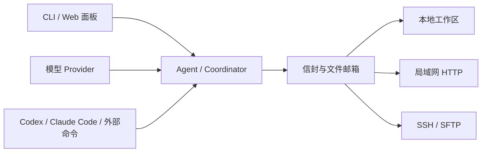

# AntHill（蚁丘）

AntHill 是一个基于文件邮箱的多 Agent 协作框架。它让本地模型 Agent、Codex、
Claude Code、命令行工具和人工会话通过同一套消息协议协同工作，并提供任务编排、
跨机器通信和可视化控制面板。

[English](./README.en.md) · [快速使用说明](./QUICKSTART.md) · [License](./LICENSE)

## 为什么使用 AntHill

传统的多 Agent 系统通常把通信、模型调用和任务调度绑在同一个进程里。AntHill 将消息
保存为工作区中的信封文件，传输层只负责把信封送到目标邮箱，Agent 如何处理消息与消息
从哪里到达相互独立。

这带来几个直接好处：

- **消息可追踪**：投递、回执、重试和处理结果都有落盘记录，进程重启后可以恢复。
- **Agent 类型不限**：既可以调用模型 API，也可以运行外部命令、连接交互式终端，
  或由人直接回复。
- **单机和跨机行为一致**：同工作区、本机其他工作区、局域网和 SSH 都使用相同信封协议。
- **协作过程可观察**：控制面板、结构化日志和任务黑板展示 Agent、消息与运行状态。

## 核心能力

- Maildir 风格文件邮箱，原子写入、幂等消费、回执、重试和死信处理
- 通过名称、角色和 `@mention` 路由消息
- Anthropic 与 OpenAI 兼容模型接入
- ReAct 工具循环，以及路径、预算和高风险操作控制
- Coordinator 计划、依赖调度、条件步骤、人工审批、超时和产物校验
- Agent 角色卡，可描述职责、专业背景和工作方式
- Web 控制面板，可管理工作区、Agent、模型、消息和任务
- 局域网节点发现与配对、HMAC 签名投递、SSH/SFTP 传输
- Codex、Claude Code、普通命令行程序和人工桥接会话接入
- MCP server/client 集成

## 工作方式



每个工作区都有自己的 `.anthill` 目录，其中保存节点配置、Agent 邮箱、对话历史、
任务黑板和运行日志。消息先写入临时文件，再通过原子重命名进入收件箱；Agent 完成处理
后才归档并更新去重状态，因此异常退出的消息可以重新领取。

## 环境要求

- Python 3.11 或更高版本
- [uv](https://docs.astral.sh/uv/)
- 使用模型 Agent 时，需要相应 Provider 的 API 密钥

## 安装

```bash
git clone https://github.com/ykxian/anthill.git
cd anthill
uv sync --extra llm
```

如果还需要 MCP 集成：

```bash
uv sync --extra llm --extra mcp
```

## 快速开始

从仓库根目录启动一个可写控制面板：

```bash
uv run anthill serve -w ./demo --panel-write
```

打开 <http://127.0.0.1:45778/panel>。首次启动会创建工作区，之后可以直接在面板中：

1. 配置模型 Provider 和 API 密钥。
2. 创建 Agent，并选择 worker、coordinator 或 bridge 角色。
3. 根据需要填写角色卡和工具权限。
4. 启动 Agent，发送消息或创建协作任务。

密钥保存在 `~/.anthill/secrets.env`，不会写入工作区的 `node.toml`。

如果更喜欢命令行：

```bash
uv run anthill agent list -w ./demo
uv run anthill agent start echo -w ./demo
uv run anthill send echo "你好，请介绍一下当前工作区" --wait 30 -w ./demo
uv run anthill status -w ./demo
```

运行多 Agent 任务时，需要至少一个配置了模型的 coordinator：

```bash
uv run anthill run "检查项目测试，并让 reviewer 复核结果" -w ./demo
```

更完整的模型配置、Codex/Claude Code 接入和常见问题见
[QUICKSTART.md](./QUICKSTART.md)。

## Agent 类型

AntHill 使用统一的运行时处理不同类型的 Agent：

| 类型 | 用途 |
|---|---|
| Provider Agent | 调用 Anthropic 或 OpenAI 兼容模型，并使用受控工具完成任务 |
| Coordinator | 将目标拆成依赖步骤，分派给其他 Agent，并汇总交付结果 |
| Command Agent | 每封消息启动一次外部命令，例如 `codex exec` 或 `claude -p` |
| Bridge Agent | 将常驻 Codex、Claude Code 会话或人工操作接入消息网络 |
| Echo Agent | 不调用模型，用于验证工作区、路由和传输是否正常 |

角色卡是可选的项目数据，只用于描述 Agent 的职责和工作偏好。它不会授予新工具、
提高来源信任等级，也不能绕过固定的安全规则或审批流程。

## 跨机器协作

在需要互联的机器上监听局域网地址：

```bash
uv run anthill serve -w ./demo --host 0.0.0.0 --panel-write
```

发现节点后，通过一次性 PIN 完成配对：

```bash
# 机器 A
uv run anthill peers pair -w ./demo

# 机器 B
uv run anthill peers pair --to <A的节点名> --pin <六位PIN> -w ./demo
```

请在两端核对显示的指纹。发现只代表节点可见，未配对节点不能投递消息或读取状态。
需要通过 SSH 连接不能反向访问的服务器时，可使用 SFTP 投递以及 `anthill pull`、
`anthill fetch` 拉取回信和产物，详见快速使用说明。

## 常用命令

```bash
uv run anthill doctor -w ./demo             # 检查配置、密钥、邮箱和进程
uv run anthill guide                        # 按场景查看命令入口
uv run anthill agent ps                     # 查看本机所有工作区的 agentd
uv run anthill runs -w ./demo               # 查看任务运行记录
uv run anthill cost -w ./demo               # 查看 token 与费用统计
uv run anthill log echo --follow -w ./demo  # 跟踪结构化日志
uv run anthill dead list -w ./demo           # 查看死信
```

## 安全边界

- `anthill serve` 默认只监听 `127.0.0.1`；对外监听必须显式指定 `--host`。
- 面板默认只读；写入能力需要显式启用，并受到本机或面板令牌鉴权限制。
- 项目配置只保存密钥对应的环境变量名，密钥单独存放并限制文件权限。
- 未配对节点不受信任，跨节点请求需要签名并检查时间窗。
- 来信正文、共享黑板和角色卡都按不可信项目数据处理，不能覆盖系统安全规则。
- 文件工具限制在工作区内，路径规范化后还会检查符号链接逃逸。
- 高风险工具调用需要确认；无人值守模式下无法确认的操作会被拒绝。
- 外部 Codex、Claude Code 和命令行程序仍使用各自的权限系统，AntHill 不会绕过它们。

面板令牌等同于对工作区的管理权限。不要在不可信网络中通过明文 HTTP 传输；远程管理
优先使用 SSH 端口转发。

## 工作区结构

```text
demo/.anthill/
├── node.toml                 # 节点、Provider 和 Agent 配置
├── agents/<name>/
│   ├── mailbox/              # inbox / outbox / 回执 / 死信
│   ├── threads/              # 对话历史
│   └── bridge/               # 可选的交互式桥接目录
├── blackboard/
│   ├── BOARD.md              # 共享状态摘要
│   └── tasks/<task_id>/      # 任务状态与产物
└── logs/                     # 结构化运行日志
```

## 开发

安装全部开发依赖：

```bash
uv sync --all-groups --all-extras
```

运行质量检查：

```bash
uv run pytest
uv run ruff check anthill tests
uv run ruff format --check anthill tests
uv run mypy anthill
```

浏览器测试需要额外安装 Chromium：

```bash
uv run playwright install chromium
```

## License

[MIT](./LICENSE)
