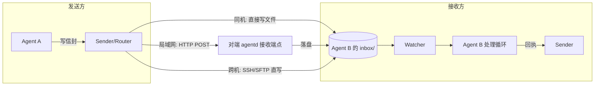
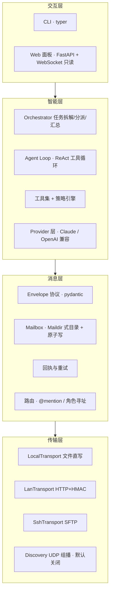
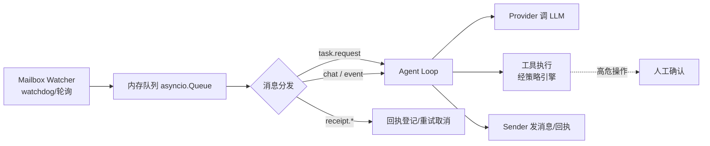
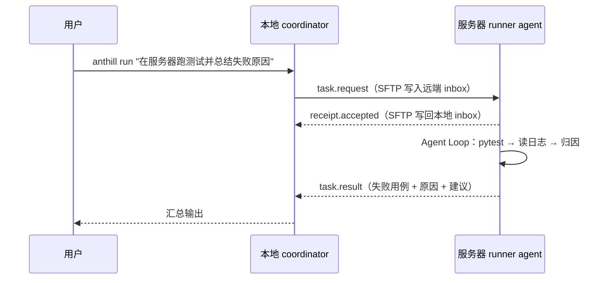

# 01 · 总体架构设计

## 1. 核心概念

| 概念 | 说明 |
|------|------|
| **Agent** | 一个有身份（name/role/persona）、有大脑（LLM + 工具）、有邮箱的自治单元。以守护进程 `anthill agent start` 形式运行 |
| **Mailbox（邮箱）** | Agent 的收发件目录，Maildir 变体结构。**Agent 感知世界的唯一入口** |
| **Envelope（信封）** | 一条消息的 JSON 文件，含收发方、类型、线程、载荷、签名，见 02-protocol |
| **Transport（传输）** | 把信封文件从发送方送达接收方邮箱的机制。三种实现：Local / LAN / SSH |
| **Receipt（回执）** | 对消息的确认，三级：delivered / accepted / completed |
| **Node（节点）** | 一台机器上的 anthill 运行环境，可承载多个 Agent，共享一个 node 配置 |
| **Coordinator（编排者）** | 一个特殊角色的 Agent：接用户命令、拆任务、派活、催活、汇总 |
| **Blackboard（黑板）** | 节点内共享目录，存放任务上下文、决策记录，供多 Agent 共读 |
| **Adapter（适配器）** | 让非自研 Agent（如监控文件夹的 Claude Code）接入邮箱网络的桥接层 |

## 2. 第一性原理：一切皆邮箱

整个系统只有一条公理：

> **Agent 之间的所有通信，最终都表现为"一个信封文件出现在目标 Agent 的 inbox 目录里"。**

由此推出三个重要性质：

1. **传输与消费解耦**。Agent 只管监控自己的 inbox，完全不关心信封是同机进程写入的、
   局域网 HTTP 收下来的、还是 SSH/SFTP 推过来的。新增一种传输方式不需要改 Agent 一行代码。
2. **天然持久化与可审计**。消息就是文件，崩溃不丢（配合原子写）、可以 `ls` 可以 `cat`、
   可以进 git、可以事后重放整个协作过程。
3. **异构 Agent 零成本接入**。任何能"读写文件"的东西都能当 Agent —— 
   这正是你们"Claude Code 监控文件夹"土办法能直接升级接入的原因。



## 3. 分层架构



依赖方向严格自上而下：智能层只依赖消息层接口，消息层只依赖传输层接口。
**L1/L2 完全不含任何 LLM 逻辑**，可以单独测试，甚至单独拿去给"人肉 Agent"用
（这就是你们团队现在的用法）。

## 4. 单节点内部结构

一个 `anthill agent start --name coder` 进程内部：



处理一条 `task.request` 的生命周期：

1. Watcher 发现 `inbox/new/` 出现新信封 → 校验签名与 schema → 移入 `inbox/cur/` → 入队
2. 立即回 `receipt.accepted`（"我收到了并开始干"—— 即你们土办法中的"回执"）
3. Agent Loop 组装上下文（persona + 线程历史 + blackboard 摘要）→ LLM 循环执行工具
4. 产出结果 → 发 `task.result`（含产物路径/内容摘要）→ 归档信封到 `inbox/done/`
5. 失败则发 `task.error`，coordinator 决定重试或改派

## 5. 三种部署形态

### 5.1 单机多 Agent（场景 A，MVP 核心）

所有 Agent 的邮箱都在同一个工作区目录下，LocalTransport 就是 `os.rename`：

```text
workspace/.anthill/
├── node.toml                 # 节点配置：agent 列表、模型映射、策略
├── agents/
│   ├── coordinator/mailbox/
│   ├── coder/mailbox/
│   └── reviewer/mailbox/
├── blackboard/               # 共享黑板（任务上下文、决策）
└── logs/
```

### 5.2 本地 + 服务器（场景 B，SSH）

两边各跑各的 agentd；本地节点配置一个 ssh peer，SshTransport 用 SFTP
把信封写进远端 `.anthill/agents/<name>/mailbox/inbox/new/`，回执按信封里的
`reply_via` 原路返回。**不需要在服务器上开任何端口**，复用 SSH 认证与加密，
这是选 SFTP 直写而不是自建 TCP 服务的核心理由。



### 5.3 局域网发现（场景 C，默认关闭）

- `discovery.enabled = false` 是默认值。**不开启时节点完全静默**：不发包、不监听组播，
  同一台机器/网段上的其他 Agent 与你互不可见 —— 这就满足了"默认不广播、不被打扰"的要求。
- 显式开启后：UDP **组播**（239.x.x.x，而非全网广播，减小打扰面）周期性 announce
  节点摘要（node 名、agent 角色列表、HTTP 端点、指纹）。
- 发现 ≠ 可通信。对端出现在 `anthill peers` 列表后，必须 `anthill peers trust <node>`
  （TOFU 确认指纹 + 配置共享密钥）才允许互投消息。收到未信任节点的消息直接丢弃并告警。

## 6. 编排模型（用户命令 → 多 Agent 协同）

采用**中心编排 + 点对点对话**的混合模式：

- **中心编排**：coordinator 负责任务拆解（LLM 产出结构化计划 JSON）、按角色分派、
  超时催办、结果汇总。保证"有人对用户负责"。
- **点对点对话**：worker 之间可以直接 @mention 通信（如 coder 写完 @reviewer），
  不必事事经过 coordinator，消息路由层按角色名解析收件人。
- **防失控**：envelope 携带 `hops` 计数与线程消息上限，超限自动熔断并上报 coordinator，
  防止两个 Agent 互相 @ 出无限循环（PRD 风险表第 3 条）。

角色是配置出来的而非硬编码，`node.toml` 里声明每个 Agent 的
role / persona / model / 可用工具，天然支持"DeepSeek 写码、Claude 审查"的跨模型互审。

## 7. 关键取舍记录（ADR 摘要）

| 决策 | 选择 | 放弃的方案与原因 |
|------|------|----------------|
| 消息底座 | 文件邮箱 | Redis/RabbitMQ：引入重依赖，丢掉"任何工具可接入 + 可审计"的差异点；本项目消息量级（每秒 << 100）文件完全够用 |
| 跨公网通信 | 统一走 SSH | 自建 TLS + 公网端点：证书/穿透/安全面太大，SSH 是开发者已有的信任通道 |
| LAN 投递 | HTTP POST 到对端 agentd | 直接 SMB/NFS 共享目录：权限混乱且不可控；UDP 投递：不可靠 |
| 发现协议 | UDP 组播 + 默认关闭 | mDNS/zeroconf 库：可加分但先自研简版更有学习价值，接口留好后期可换 |
| 编排 | 中心 coordinator + P2P @mention | 纯去中心：结果无人负责、难汇总；纯中心：消息两跳浪费且不像"团队" |
| Agent 大脑 | 自研 ReAct loop | LangGraph/AutoGen：直接用就失去学习与面试价值；其范式作为参考 |
