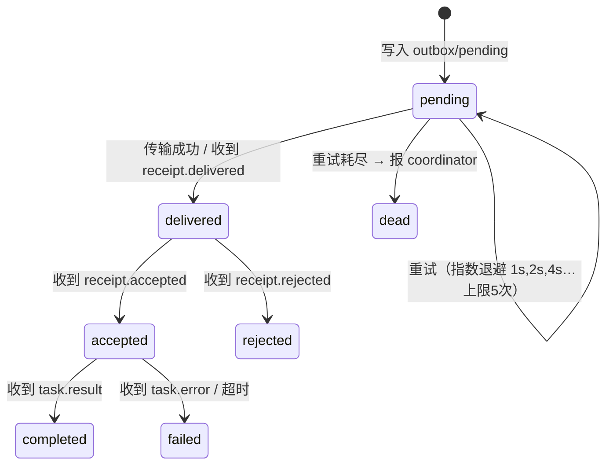

# 02 · 通信协议设计（Envelope + Mailbox + Receipt）

> 本文档是系统的"宪法"。L1/L2 的所有实现必须严格遵守；协议变更需 bump `proto` 版本号。

## 1. 消息信封（Envelope）

一条消息 = 一个 JSON 文件。文件名即消息 ID：`<ulid>.json`（ULID 单调递增，
天然按时间排序，避免 UUID 无序问题）。

```json
{
  "proto": "1.0",
  "id": "01J1QZ3AC9V6EXAMPLE0000001",
  "ts": "2026-07-31T15:04:05.123+08:00",
  "from": {"node": "laptop-ykx", "agent": "coder"},
  "to": {"node": "laptop-ykx", "agent": "reviewer"},
  "type": "task.request",
  "thread": "01J1QZ2XXXTHREAD000000001",
  "reply_to": null,
  "reply_via": {"transport": "local", "endpoint": null},
  "hops": 1,
  "ttl_hops": 8,
  "expires_at": "2026-07-31T16:04:05+08:00",
  "payload": {
    "title": "审查 tests/test_date.py",
    "body": "我为 utils/date.py 写了 12 个用例，请审查边界条件覆盖…",
    "artifacts": ["blackboard/tasks/T42/tests_test_date.py"],
    "priority": "normal",
    "risk": "low"
  },
  "sig": "hmac-sha256:BASE64…"
}
```

### 字段说明

| 字段 | 类型 | 说明 |
|------|------|------|
| `proto` | str | 协议版本，不兼容变更时递增 |
| `id` | ULID | 全局唯一消息 ID，同时是文件名，幂等去重的键 |
| `ts` | ISO8601 | 发送时间，参与签名，防重放校验用（见 §6） |
| `from` / `to` | obj | `node + agent` 二元寻址。`to.agent` 可为角色名（如 `role:reviewer`），由路由层解析 |
| `type` | enum | 消息类型，见下表 |
| `thread` | ULID | 会话线程 ID。**上下文按 thread 严格隔离**（cat-cafe 第八课"跨 thread 污染"的教训） |
| `reply_to` | ULID? | 回复哪条消息 |
| `reply_via` | obj | 回执/回复的返回通道提示（local / lan+endpoint / ssh+peer 名） |
| `hops` / `ttl_hops` | int | 每次因本消息触发新消息时 hops+1，超过 ttl_hops 拒发并告警 → 熔断 @ 循环 |
| `expires_at` | ISO8601 | 过期消息不再处理，直接归档并回 `receipt.expired` |
| `payload` | obj | 按 type 定义各自的 pydantic 子 schema，严格校验 |
| `sig` | str | HMAC-SHA256 签名，仅跨节点消息必填（见 §6） |

### 消息类型

| type | 方向 | 语义 |
|------|------|------|
| `task.request` | 请求方 → 执行方 | 派活。payload 含 title/body/artifacts/priority/risk |
| `task.result` | 执行方 → 请求方 | 交付。payload 含 summary/artifacts/status(ok/partial) |
| `task.error` | 执行方 → 请求方 | 失败。payload 含 error/retryable |
| `chat` | 任意 | 自由讨论、@mention 对话（协作的"聊天"通道） |
| `receipt.delivered` | 传输层自动 | 信封已落对方 inbox（Local 场景可省略，写入成功即 delivered） |
| `receipt.accepted` | Agent 自动 | 已受理开始处理 —— 对应你们土办法的"回执" |
| `receipt.rejected` | Agent 自动 | 拒绝处理（策略不允许 / 无此角色 / 过载），含原因 |
| `event` | 任意 → 订阅方 | 状态广播：任务进度、blackboard 更新通知 |
| `heartbeat` | agentd → peers | P2 阶段：存活探测，供故障转移 |

## 2. 邮箱目录规范（Maildir 变体）

```text
mailbox/
├── inbox/
│   ├── tmp/        # 写入中（不完整文件只会出现在这里）
│   ├── new/        # 已送达未处理 —— watcher 只监控这个目录
│   ├── cur/        # 处理中
│   └── done/       # 已处理归档（按日期分子目录 done/2026-07-31/）
├── outbox/
│   ├── pending/    # 待发送/发送失败待重试（含 .meta 重试计数）
│   └── sent/       # 已确认送达
└── seen.db         # 已见消息 ID 集（SQLite 单表），幂等去重
```

### 原子写协议（并发安全的关键）

> 规则：**任何写入方（本机进程、SFTP、HTTP 接收端）都必须先写 `tmp/` 再 rename 进 `new/`。**

```text
1. 写入 inbox/tmp/<ulid>.json.part   （可分多次写，允许中断）
2. fsync
3. rename → inbox/new/<ulid>.json    （同一文件系统内 rename 是原子的，POSIX 保证）
```

- 消费方永远不会读到半个文件；`tmp/` 中的残留文件由清扫任务超时删除。
- 文件名 = ULID 保证多个发送方并发投递永不冲突，**无需任何锁**。
- SFTP 场景同理：`put` 到 tmp、远端 `rename`（SFTP 协议原生支持 rename）。

## 3. 回执与消息状态机

发送方视角，一条 `task.request` 的状态机：



- **超时**：accepted 后超过 `task_timeout`（默认 10 分钟，可按任务配置）未收到
  result，coordinator 发起催办 `chat`，再超时则标记 failed 并考虑改派。
- **本地传输**的 delivered 由"rename 成功"隐含，不发独立回执文件，减少一半消息量。

## 4. 幂等与去重

- 接收方处理前查 `seen.db`：命中则直接丢弃（但仍补发对应回执，保证发送方状态机收敛）。
- 这使得所有传输层都可以放心"至少一次投递 + 重试"，语义合成为**恰好一次处理**。
- `seen.db` 按 `expires_at` 上限 + 7 天滚动清理。

## 5. 路由与 @mention

- 寻址：`to.agent` 支持三种形式 —— 具体名（`coder`）、角色（`role:reviewer`，
  节点内有多个则选负载最低者）、广播组（`all`，仅 event 类型允许）。
- @mention：Agent Loop 的输出文本中出现 `@reviewer` 时，`send_message` 工具由
  路由层自动补全收件地址并挂到当前 thread —— Agent 只需"像人一样说话"。
- 跨节点寻址 `node:agent` 需要该 node 在本机 peers 信任列表中，否则拒发。

## 6. 安全设计

| 层面 | 机制 |
|------|------|
| 同机 | 依赖文件系统权限（mailbox 目录 0700），不签名 |
| 局域网 | 每对 peer 一个共享密钥（trust 时交换）。签名 = HMAC-SHA256(canonical_json(envelope 去 sig 字段), key)。`ts` 偏差 > 5 分钟拒收（防重放），`id` 重复丢弃（第二道防重放） |
| SSH | 通道安全交给 SSH 本身；信封仍带签名，防止远端多用户环境下的伪造投递 |
| 信任模型 | 发现 ≠ 信任。TOFU：首次 trust 记录节点指纹，指纹变化立即告警拒收 |
| 内容安全 | **来自其他 Agent 的消息一律视为不可信输入**（防 Agent 间 prompt 注入）：进入上下文时包裹显式边界标记；消息内容永远不能直接触发高危工具，必须过策略引擎（03-tech-design §6） |

## 7. 共享黑板（Blackboard）协议

- `blackboard/BOARD.md`：≤ 100 行的当前状态快照（在做什么、谁负责、卡在哪），
  由 coordinator 维护，每个 Agent 的上下文里都会注入 —— 借鉴 collab-cli 的 SHARD.md。
- `blackboard/tasks/<task_id>/`：每个任务一个目录，放任务产物（代码、报告），
  envelope 里只传路径引用，**大文件不进消息体**（消息体上限 64KB）。
- `blackboard/decisions/`：一事一文件的决策记录，Agent 可检索。
- 写规则：单写者原则 —— BOARD.md 只有 coordinator 写；任务目录只有 assignee 写；
  跨节点场景 blackboard 不共享，靠 artifacts 随消息按需同步（P1 用 SFTP 拉取）。

## 8. 协议一致性测试清单（TDD 起点）

这些用例在写任何传输实现之前先写好（RED）：

1. envelope schema：非法字段/缺字段/超大 payload 全部拒绝，错误信息明确
2. 原子写：模拟写一半崩溃，`new/` 中永无残缺文件
3. 并发投递：100 个并发写者投同一邮箱，无丢失无重复
4. 幂等：同一信封投递 3 次，业务处理恰好 1 次，回执 3 次
5. 重试状态机：模拟传输失败 → 指数退避 → dead letter 上报
6. hops 熔断：构造 A@B、B@A 循环，第 `ttl_hops` 跳被拒发
7. 签名：篡改 payload / 过期 ts / 重复 id 三种攻击全部被拒
8. thread 隔离：两个并发 thread 的上下文互不泄漏
