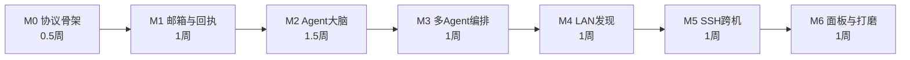

# 04 · 里程碑与任务清单

> 节奏假设：学生课余时间，每周 10–15 小时（Claude Code 辅助开发）。总计约 7 周。
> 铁律：**每个里程碑结束时都有一个能独立演示的东西**，秋招提前到来也不至于空手。

## 总览

依赖关系：M4 与 M5 相互独立，可按兴趣调换顺序；M6 的面板部分可与 M4/M5 并行。

---

## M0 · 协议骨架（0.5 周）

**目标**：协议层代码 + 测试全绿，还没有任何 LLM。

- [x] 仓库初始化：uv + pyproject + ruff/mypy/pre-commit + GitHub Actions
- [x] `core/envelope.py`：Envelope 与各 payload 的 pydantic 模型（TDD：02-protocol §8 用例 1）
- [x] `core/mailbox.py`：目录创建、原子写、归档、seen.db（用例 2/3/4）
- [x] `core/ids.py`、`core/config.py`（node.toml 解析 + fail-fast 校验）

**验收**：`pytest` 全绿；并发 100 写者压力测试无丢失无重复；覆盖率 ≥ 90%（此层）。

**实际结果（已达成）**：125 个测试全绿；envelope 96% / payloads 100% / seen 100% /
router 98% / states 96% / outbox 95% / mailbox 92%；mypy strict 与 ruff 全绿。
`core/mailbox.py` 拆成了 `atomic.py`（原子写）+ `mailbox.py`（目录语义）+ `seen.py`（去重），
另外多出 `paths.py`（目录布局）、`states.py`（回执状态机）、`outbox.py`（重试）、`router.py`（寻址）。

## M1 · 邮箱与回执 —— 土办法的工程化（1 周）

**目标**：两个 agentd（还没大脑，收到消息只会回显）在同一台机器上互发消息、互回回执。

- [x] `transport/local.py` + `transport/base.py`（另加 `transport/registry.py` 按目标选传输）
- [x] `agent/runtime.py`：watcher（含 NFS 降级自检）→ 队列 → 分发骨架
- [x] 回执状态机 + outbox 重试（用例 5）、hops 熔断（用例 6）
- [x] CLI：`anthill init`、`anthill agent start/list`、`anthill send`、`anthill status`、`anthill log --follow`

**验收**：终端 A 启动 echo-agent，终端 B `anthill send` 一条消息，
能看到 accepted 回执与回显 result；kill -9 任一方后重启不丢消息。
**这一步完成，你们团队现在的手工方案就已经被正式替代了。**

**实际结果（已达成）**：手工联调跑通 `init → agent start → send --wait`，
accepted 回执与 task.result 都能原路回到 CLI 邮箱；agent 未启动时投递的消息在启动后
被补处理；`cur/` 里的崩溃残留会在启动时 requeue（日志 `agentd.recover requeued=1`）。

联调时抓到两个测试没覆盖的真 bug，已修并补了回归测试：
1. 重试循环会抢发「首次投递还在路上」的消息（日志现象：`delivery.retry attempts=0`
   加 `非法状态迁移：delivered → delivered`）→ Sender 增加 in-flight 集合。
2. watcher 按文件名去重，导致同一 ULID 被重复投递时第二次被静默吞掉
   → 去重键改为 `(文件名, inode)`，把判重交还给 seen.db 这一层。

## M2 · Agent 大脑（1.5 周）

**目标**：单个 Agent 能用 LLM + 工具真正完成任务。

- [x] `providers/`：openai_compat + anthropic，`--record/--replay` 录制回放
- [x] `agent/tools/`：read_file / write_file / list_dir / run_shell / finish（路径逃逸防护）
- [x] `security/policy.py`：风险分级 + CLI 确认流
- [x] `agent/loop.py` + `context.py`：ReAct 循环、token 预算、步数/费用熔断
- [x] `agent/memory.py`：thread 历史落盘 + 超长摘要

**验收**：`anthill send coder "给 demo 项目的 date.py 写单测并跑通"`，
Agent 自主完成写文件 → 跑 pytest → 交付结构化 result；危险命令会弹确认。

**实际结果（已达成）**：234 个测试全绿，总覆盖率 89%；mypy strict 与 ruff 全绿。
用录制带在真实 CLI 上跑通 `init → agent start --replay → send --wait`：
Agent 写出 `greet.py`，试图跑 `python3 -c ...` 时被策略引擎拦下（无人值守 → 拒绝），
随后用 `finish` 交付 `{summary, artifacts:["greet.py"], status:"ok"}` 回到 CLI 邮箱。

几处实现上偏离原设计、值得在面试里讲的决定：

1. **未知来源在进上下文前就被拒**，而不是靠工具层逐次拦。理由：prompt 注入的成本
   应该停在「模型根本没看到它」这一步，而不是指望模型每次都守规矩。
2. **不可信定界符做转义**。来件里若自带一个「结束定界符」想逃出数据区，会被打断成
   `..._ESCAPED>>>` —— 只声明规则而不做转义，等于把安全性全押在模型的自觉上。
3. **工具失败不抛异常，而是作为 `role=tool` 结果回喂**。让模型看见错误自己改，
   是 ReAct 最有价值的部分；只有熔断与模型调用失败才中止任务。
4. **`--unattended` 不是「全部同意」而是「一律拒绝」**。第一版把它命名成 `--yes`，
   联调时立刻意识到这个名字会让人误以为是自动放行 —— 安全开关的命名不能有歧义。
5. **回放模式跳过 API key 体检**。`--replay` 根本不连上游，却因为「没 export key」
   被 fail-fast 拒绝启动，是把体检做成了教条。

## M3 · 多 Agent 编排（1 周）—— 核心演示场景 A 达成

- [ ] `orchestrator/plan.py`：计划 JSON schema + 强制结构化输出（校验失败重试）
- [ ] `orchestrator/coordinator.py`：拓扑调度、子 thread、催办、`done_when` 判定
- [ ] @mention 路由 + `send_message` 工具
- [ ] blackboard：BOARD.md 单写者维护 + 任务产物目录
- [ ] `anthill run "<任务>"` 端到端命令 + rich 实时消息流渲染

**验收**：场景 A 全流程（coder 写 → @reviewer 审 → coder 改 → 汇总）无人工干预跑通，
两个角色用两家模型；构造 @ 循环被熔断。**录第一支演示视频。**

## M4 · LAN 发现与投递（1 周）—— 场景 C

- [ ] `discovery/beacon.py`：UDP 组播 announce/probe，**默认 enabled=false**
- [ ] `discovery/registry.py`：peers 列表、`anthill peers trust`（TOFU 指纹）
- [ ] `security/signing.py`：HMAC + 时间窗防重放（用例 7）
- [ ] `transport/lan.py` + FastAPI `/deliver` 端点（未信任来源直接拒收）

**验收**：两台机器（或同机两个 workspace + 不同端口模拟）：默认互相不可见；
双方开启 discovery 并 trust 后可互派任务；抓包确认关闭时零发包；
篡改消息被拒收。

## M5 · SSH 跨机（1 周）—— 场景 B

- [ ] `transport/ssh.py`：asyncssh SFTP 投递（tmp→rename）、连接复用与重连
- [ ] 远端 artifacts 按需拉取（result 引用的产物 SFTP get）
- [ ] 远端 high 风险操作强制本地确认的策略打通

**验收**：本地 coordinator 派任务给学校服务器上的 runner agent，
远端跑 pytest 并回传失败归因；全程服务器不开任何新端口。**录第二支演示视频。**

## M6 · 面板与打磨（1 周）

- [ ] `web/`：拓扑 + 实时消息流 + 任务看板（只读，127.0.0.1）
- [ ] README（中英）：架构图、快速开始、三支演示 GIF/视频
- [ ] 补测试到全项目 ≥ 80%；CHANGELOG；MIT LICENSE
- [ ] （加分，二期候选）Claude Code Adapter：把你们的文件夹监控用法接成正式 Agent

**验收**：陌生同学按 README 10 分钟跑通场景 A；covr 报告 ≥ 80%；仓库开源发布。

---

## 里程碑外的持续事项

- 每个 M 结束：更新 docs、给 demo 打 git tag（v0.1 ~ v0.7）
- 每写完一个模块跑 code review（CLAUDE 规则里的 code-reviewer 流程）
- 花销记录：provider 层自动统计 token 费用，写进 logs，防止调试烧钱失控

## 砍单预案（时间不够时的优先级）

秋招时间紧张时按此顺序砍：M6 面板 → M4 LAN → （M5 SSH 保留，它是差异化亮点）。
M0–M3 + M5 就足以支撑一份有说服力的简历项目；M4 可以只留设计文档并在面试中口述。
